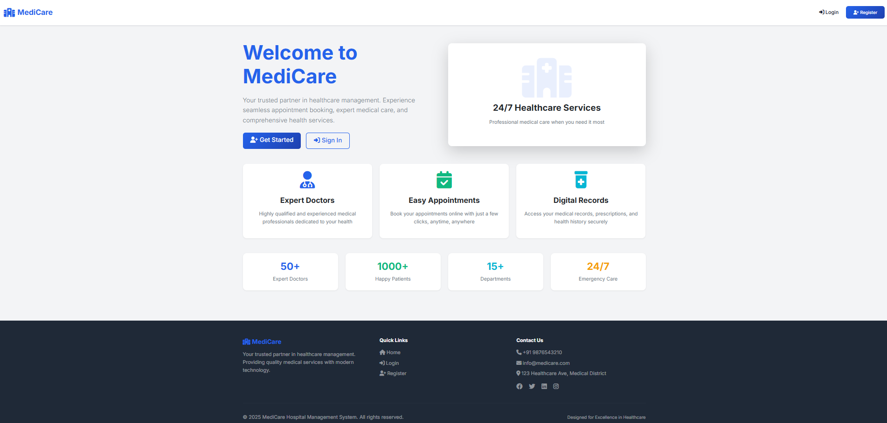
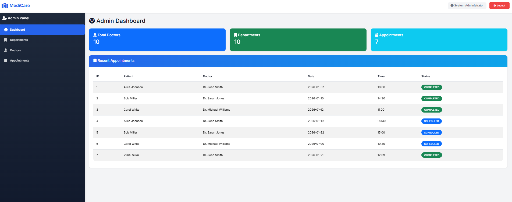
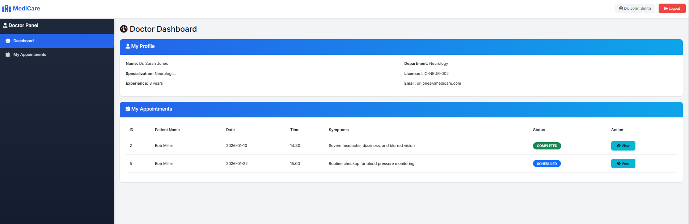
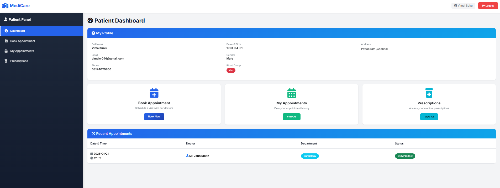
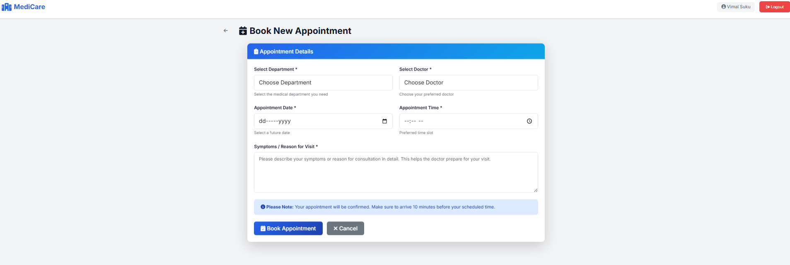

# 🏥 MediCare - Hospital Management System

A comprehensive, production-ready Hospital Management System built with **Spring Boot 3.x**, featuring role-based authentication, appointment scheduling, prescription management, and electronic health records.


---

## 📋 Table of Contents

- [Overview](#overview)
- [Features](#features)
- [Technologies](#technologies)
- [Screenshots](#screenshots)
- [Getting Started](#getting-started)
- [Usage](#usage)
- [Project Structure](#project-structure)
- [Contributing](#contributing)
- [Contact](#contact)

---

## 🎯 Overview

MediCare is an enterprise-grade hospital management platform that streamlines healthcare operations through three distinct user roles: **Admin**, **Doctor**, and **Patient**. The system enables efficient appointment booking, prescription management, and maintains comprehensive electronic health records.

---

## ✨ Features

### 👤 **Admin Module**

- Complete hospital dashboard with statistics
- Manage departments and medical staff
- Oversee all appointments and operations
- User and role management

### 👨‍⚕️ **Doctor Module**

- Personal dashboard with appointment overview
- View and manage assigned appointments
- Add diagnoses and complete consultations
- Create and manage prescriptions
- Access patient medical history

### 🧑 **Patient Module**

- User-friendly registration and profile management
- Online appointment booking with department/doctor selection
- View appointment history and status
- Access digital prescriptions
- Track medical records

### 🔐 **Security & Architecture**

- Role-based access control (RBAC) with Spring Security
- BCrypt password encryption
- Layered architecture (Controller → Service → Repository)
- DTO pattern for data transfer
- Global exception handling
- Form validation with Bean Validation

---

## 🛠️ Technologies

### Backend

- **Java 17**
- **Spring Boot 3.2.0**
- **Spring MVC** - Web layer
- **Spring Data JPA** - Data persistence
- **Spring Security** - Authentication & Authorization
- **Hibernate** - ORM framework
- **MySQL 8.0** - Database

### Frontend

- **Thymeleaf** - Server-side templating
- **Bootstrap 5** - Responsive UI
- **HTML5/CSS3** - Modern web standards
- **JavaScript** - Client-side interactions
- **FontAwesome** - Icons

### Tools

- **Maven** - Build automation
- **Lombok** - Boilerplate reduction
- **Git** - Version control

---

## 📸 Screenshots

### Landing Page


_Modern landing page with feature highlights_

### Admin Dashboard


_Comprehensive admin panel with statistics and management tools_

### Doctor Dashboard


_Doctor's workspace for managing appointments and prescriptions_

### Patient Dashboard


_Patient portal for booking appointments and viewing records_

### Appointment Booking


_Intuitive appointment booking interface_

---

## 🚀 Getting Started

### Prerequisites

- Java 17 or higher
- Maven 3.6+
- MySQL 8.0+
- Git

### Installation

1. **Clone the repository**

```bash
git clone https://github.com/YOUR_USERNAME/medicare-hospital-management.git
cd medicare-hospital-management
```

2. **Configure MySQL Database**

Create a new database:

```sql
CREATE DATABASE medicare_db;
```

Update `src/main/resources/application.properties`:

```properties
spring.datasource.url=jdbc:mysql://localhost:3306/medicare_db
spring.datasource.username=YOUR_USERNAME
spring.datasource.password=YOUR_PASSWORD
```

3. **Build the project**

```bash
mvn clean install
```

4. **Run the application**

```bash
mvn spring-boot:run
```

5. **Access the application**

```
http://localhost:8080
```

---

## 📁 Project Structure

```
medicare/
├── src/main/java/com/hospital/medicare/
│   ├── config/              # Security & configuration
│   ├── controller/          # MVC controllers
│   ├── dto/                 # Data Transfer Objects
│   ├── entity/              # JPA entities
│   ├── repository/          # Data repositories
│   ├── service/             # Business logic
│   ├── security/            # Security components
│   └── exception/           # Exception handling
├── src/main/resources/
│   ├── templates/           # Thymeleaf templates
│   ├── static/              # CSS, JS, images
│   └── application.properties
└── pom.xml
```

---

## 🎯 Key Highlights

- ✅ **Production-Ready** - Enterprise-grade code quality
- ✅ **Security-First** - Spring Security with BCrypt encryption
- ✅ **Clean Architecture** - Layered design with DTO pattern

---

## 🔄 Future Enhancements

- [ ] Email notifications for appointments
- [ ] PDF generation for prescriptions
- [ ] REST API for mobile app integration
- [ ] Payment gateway integration
- [ ] Video consultation feature
- [ ] Advanced analytics dashboard
- [ ] Multi-language support

---

## 🤝 Contributing

Contributions are welcome! Please follow these steps:

1. Fork the repository
2. Create a feature branch (`git checkout -b feature/NewFeature`)
3. Commit changes (`git commit -m 'Add NewFeature'`)
4. Push to branch (`git push origin feature/NewFeature`)
5. Open a Pull Request

---

## 👨‍💻 Author

**Your Name**

- GitHub: [https://github.com/vimal046](https://github.com/vimal046)
- LinkedIn: [www.linkedin.com/in/vimal-s-7572b6310](www.linkedin.com/in/vimal-s-7572b6310)

---

## ⭐ Show your support

Give a ⭐️ if this project helped you learn or build something amazing!
